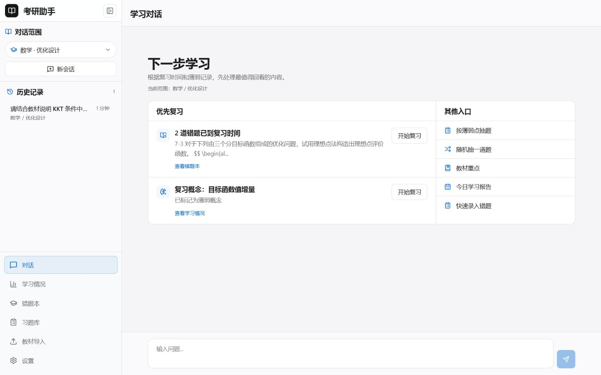
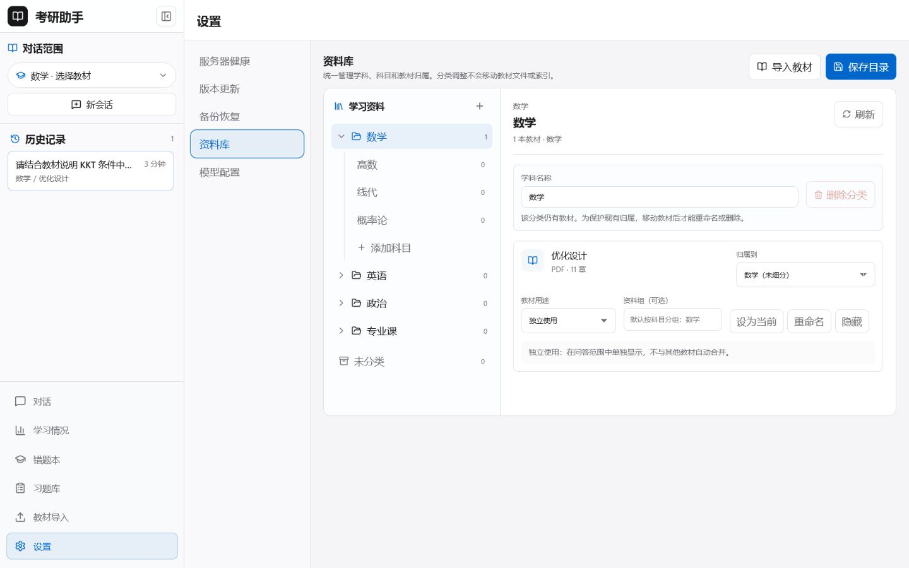
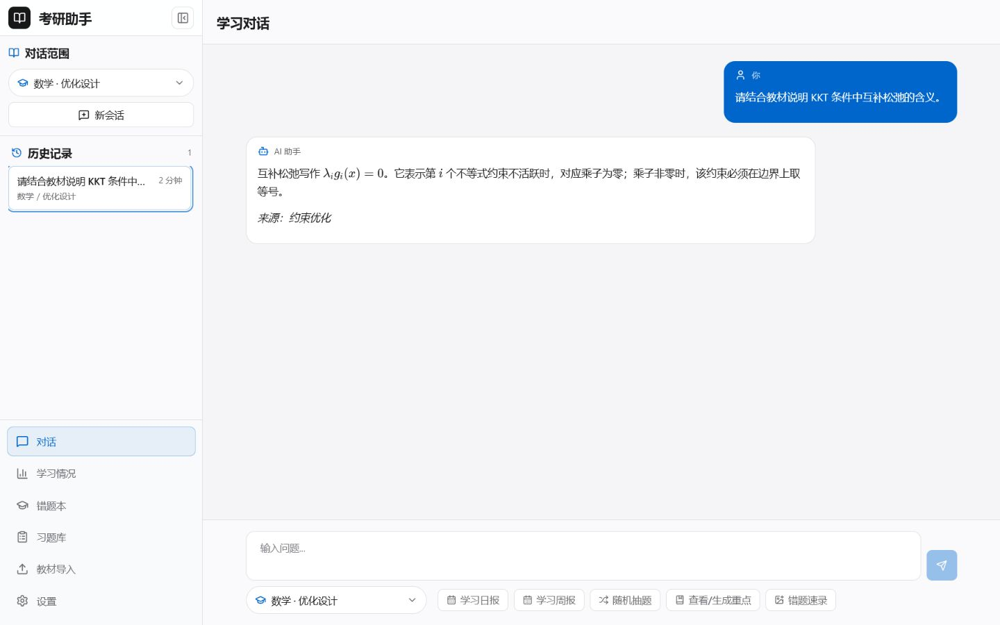
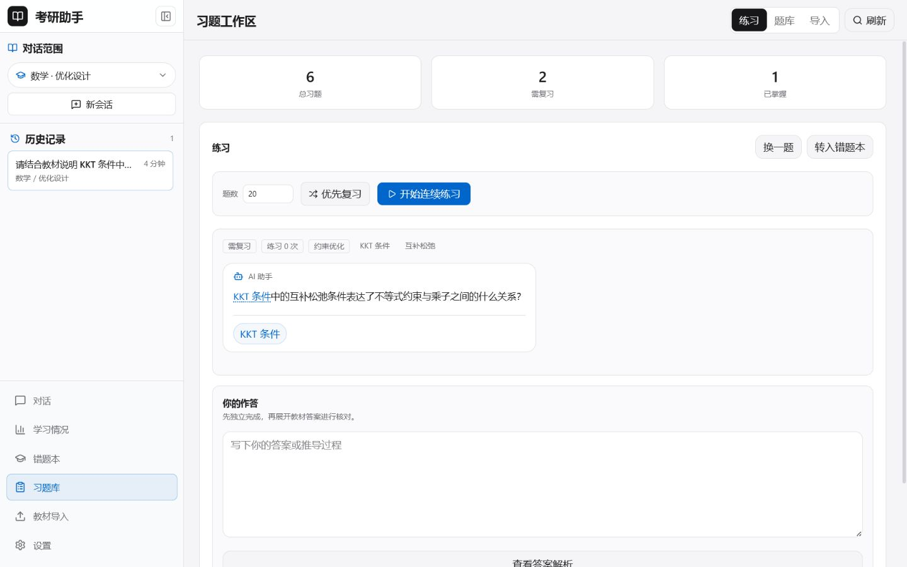
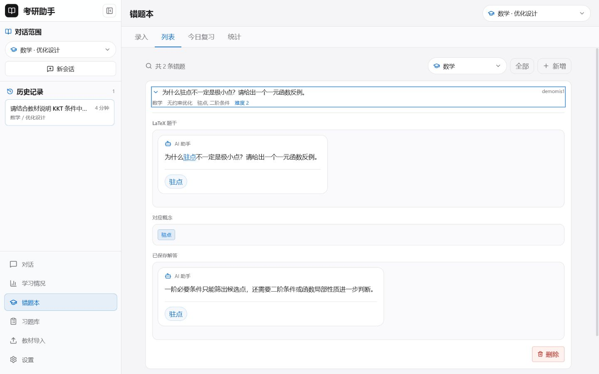
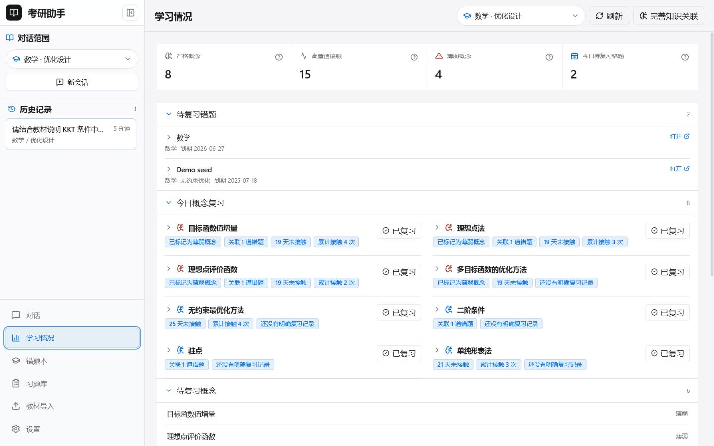

# 考研智能辅助系统

一个围绕教材、习题、错题和复习记录构建的本地优先考研学习辅助系统。

> 当前版本：1.0.0。项目处于个人项目持续开发阶段，核心本地数据闭环可运行；教材解析、OCR、LLM 生成与部分知识增强能力依赖外部服务或本地模型。仓库目前尚未添加开源许可证。

## 项目背景

考研资料通常散落在 PDF、纸质题目、聊天记录和错题笔记中。单次问答可以解决眼前问题，却很难把教材出处、练习过程、错误原因和后续复习连接起来。

本项目尝试把这些对象放进同一个本地应用：

- 教材先被解析为章节与检索片段，再用于有范围的问答。
- 习题和错题保留来源、章节、标签、概念与练习状态。
- 错题复习使用 SM-2 兼容的间隔调度。
- 概念接触和学习事件用于生成学习情况与规则式周报。
- Electron 将前后端和用户数据目录组织成桌面应用。

它不是通用聊天机器人，也不把模型生成题目当作主要练习来源。

## 当前实现状态

| 能力 | 状态 | 说明 |
|---|---|---|
| 教材管理与多教材隔离 | 已实现 | 支持导入任务、列表、切换、归档、恢复、清理与重建索引 |
| 教材问答与 SSE 流式输出 | 已实现，依赖条件 | 调用链完整；生成需要可用 LLM，语义检索需要有效索引和嵌入模型 |
| 混合检索与降级 | 已实现 | 组合知识图谱、向量、词法、语义角色和相邻片段；单个检索源失败可降级 |
| 习题库与练习会话 | 已实现 | 支持手动/批量导入、状态筛选、练习、答案记录、回滚和错题互转 |
| 错题本与间隔复习 | 已实现 | 支持手动录入、CRUD、筛选、复习历史、SM-2 兼容调度和统计 |
| 图片 OCR 录入 | 条件式实现 | 前端可裁剪和校正；错题图片识别依赖 Kimi Vision |
| 学习情况与规则周报 | 已实现 | 聚合概念、错题、习题、会话和学习事件；不是模型生成的权威评价 |
| 章节重点与知识图谱增强 | 条件式实现 | 后台任务和查看链已存在，需要教材派生数据与 LLM |
| 受控 Agent | 部分实现 | 后端工具注册和结果渲染存在，当前主界面没有完整触发入口 |
| Electron 自动更新 | 未配置 | 代码已接入 electron-updater，GitHub 发布仓库仍是占位配置 |
| PWA、推送、完整 Agent Loop | Roadmap | 当前没有可交付实现 |

更完整的代码审计见 [PROJECT_AUDIT.md](PROJECT_AUDIT.md)。

## 项目截图

截图来自 1440 × 900 的统一浏览器视口。数据来自 <code>desktop/sample_data</code> 的隔离副本和 <code>scripts/seed_docs_demo.py</code> 写入的非个人演示记录；没有使用正式 <code>data/</code>。

### 主工作台

### 教材与资料库

### 教材问答

该图用于验证已有会话、来源和 KaTeX 渲染。回答内容由隔离 demo seed 写入，不代表本次审阅调用了在线模型。

### 习题工作区

### 错题本

### 学习情况

## 核心功能

### 教材摄取与问答

教材可以经 MinerU 结果、本地解析或已有派生数据进入章节切分、chunk 建立、词法索引和 Chroma 索引。问答时，系统先确定意图与教材范围，再组合知识图谱精确命中、向量结果、词法结果、语义角色和相邻片段。生成阶段会过滤模型 thinking 内容，并以 Markdown 和 KaTeX 渲染正文。

### 习题库

习题记录包括题干、答案、解析、来源、章节、题型、难度、标签、概念链接、状态与练习历史。当前代码支持手动添加、Word/PDF 文本抽取候选、批量导入、最近批次回滚和可恢复的练习会话。

### 错题本与复习

错题记录包括用户答案、正确答案、错因、来源、标签、图片引用和复习状态。OCR 结果必须先由用户校正，不能直接视为可信题干。复习质量会更新间隔、重复次数与下次复习日期。

### 学习记忆

ConceptMemory 记录概念接触、候选链接、薄弱信号与复习信息。追加式 learning events 提供跨功能时间线，原有错题、习题和会话数据库仍是事实来源。周报是规则聚合，适合回顾，不应当作能力测评。

## 使用流程

    导入教材或导入已有 MinerU 结果
        ↓
    建立章节、chunk、词法索引与向量索引
        ↓
    在选定学科和教材范围内问答
        ↓
    将练习结果沉淀到习题库或错题本
        ↓
    按到期队列复习，并查看概念与学习汇总

只使用错题、习题和学习记录时，可以不配置在线 LLM。教材自动解析、OCR、回答生成和知识增强需要相应服务。

## 技术架构

    Electron main
      ├─ 启动 FastAPI / 打包后的 PyInstaller 后端
      ├─ 生成每次启动使用的本地 API token
      └─ 加载 React 应用并管理用户数据目录

    React + Vite
      ├─ REST: 教材、错题、习题、学习情况、系统与备份
      └─ SSE: plan → retrieve → chapter → generate → done/error

    FastAPI
      ├─ graph/: LangGraph 问答编排
      ├─ ingestion/: PDF、MinerU、OCR、切分与索引
      ├─ knowledge/: 知识图谱、概念记忆、章节重点
      └─ memory/: 错题、习题、SM-2、学习事件

    Storage
      ├─ ChromaDB: 向量索引
      ├─ SQLite: 错题、习题、学习事件、任务
      ├─ JSON: 会话与部分学习状态
      └─ Files: PDF、章节、图片与派生产物

### 教材问答主要调用链

    ChatPage / useChat
      → POST /api/chat/stream
      → 会话历史与追问改写
      → run_graph_stream()
      → 意图规划
      → KG / 向量 / 词法混合检索
      → teach 或 summarize 时准备章节内容
      → LLM 流式生成 + thinking 过滤 + LaTeX 清洗
      → 概念链接与学习事件
      → SSE 完成或错误事件
      → 前端累积正文、来源与会话历史

## 技术栈

- 桌面端：Electron 37、electron-builder、electron-updater
- 前端：React 19、TypeScript 6、Vite 8、React Router 7、Tailwind CSS 4
- 内容：react-markdown、remark-gfm、remark-math、rehype-katex、KaTeX
- 后端：Python 3.10、FastAPI、Uvicorn、Pydantic 2
- 编排：LangGraph、LangChain、OpenAI 兼容客户端
- 检索：ChromaDB、sentence-transformers、BGE 中文嵌入、词法索引、可选 CrossEncoder
- 摄取：PyMuPDF、MinerU、Kimi Vision、PaddleOCR
- 测试：pytest、Vitest
- 构建：PyInstaller、electron-builder、Docker 多阶段构建

## 项目目录

    kaoyan-assistant/
    ├── backend/          FastAPI 应用、API、任务与安全边界
    ├── frontend/         React/Vite 前端
    ├── desktop/          Electron 主进程、预加载与打包配置
    ├── graph/            问答图、规划、检索、生成和反馈
    ├── ingestion/        教材解析、OCR、切分与索引
    ├── knowledge/        知识图谱、概念记忆与章节重点
    ├── memory/           错题、习题、SM-2 与学习事件
    ├── agents/           实验性 Agent 封装
    ├── tests/            后端测试
    ├── evaluation/       RAG 评测数据与脚本
    ├── scripts/          构建、备份、索引和 demo seed
    ├── docs/images/      本次实机截图
    ├── site/             无构建工具的静态宣传页
    ├── PROJECT_AUDIT.md  当前代码审计
    └── patch_notes.md    版本、修复和实测记录

## 安装与启动

### 前置条件

- Windows 10/11 是当前桌面端主要验证环境。
- Python 必须使用 3.10。当前仓库实测为 Python 3.10.11。
- Node.js 与 npm。
- 可选：DeepSeek/OpenAI 兼容 LLM、Moonshot/Kimi、MinerU、本地 OCR 依赖。

### 安装依赖

    git clone https://github.com/jayceto946-byte/kaoyan-assistant.git
    cd kaoyan-assistant

    py -3.10 -m venv venv310
    .\venv310\Scripts\python.exe -m pip install --upgrade pip
    .\venv310\Scripts\python.exe -m pip install -r requirements.txt

    cd frontend
    npm.cmd install
    cd ..\desktop
    npm.cmd install
    cd ..

<code>requirements.txt</code> 目前使用宽泛下限而不是锁文件。审阅环境的既有 venv 在安装后仍存在 PaddleOCR、Marker、Pillow、protobuf、PyYAML、websockets 等可选栈的版本冲突；发布前建议拆分可选 OCR/解析依赖并提供锁定环境。

### 配置

    Copy-Item .env.example .env

编辑 <code>.env</code>，只填写需要使用的服务。不要提交真实密钥。

### Web 开发模式

终端 1：

    $env:SKIP_EMBEDDING_WARMUP='1'
    $env:SKIP_VECTOR_WARMUP='1'
    .\venv310\Scripts\python.exe -m uvicorn backend.main:app --host 127.0.0.1 --port 8000

终端 2：

    cd frontend
    npm.cmd run dev -- --host 127.0.0.1

访问 <http://127.0.0.1:5173>。关闭 warmup 适合先验证界面和本地数据；需要语义检索时应启用嵌入模型。

### 生产 Web 模式

    cd frontend
    npm.cmd run build
    cd ..
    .\venv310\Scripts\python.exe -m uvicorn backend.main:app --host 127.0.0.1 --port 8000

构建成功后，FastAPI 会同源提供 <code>frontend/dist</code>。

### Electron 开发模式

    cd desktop
    npm.cmd run dev

Electron 会启动后端并使用桌面用户数据目录。若已经单独启动后端，可以设置 <code>KAOYAN_BACKEND_URL</code> 后运行：

    npm.cmd run dev:existing

本次审阅实际用隔离数据在 8765 端口启动 FastAPI，并用 <code>dev:existing</code> 验证 Electron 能进入真实应用。

### 测试与构建

    .\venv310\Scripts\python.exe -m pytest -q

    cd frontend
    npm.cmd run test
    npm.cmd run lint
    npm.cmd run build

本次审阅结果：后端 137 passed；前端 3 个测试文件、9 passed；ESLint 通过；TypeScript 与 Vite 生产构建通过。

## 环境变量

| 变量 | 作用 | 是否必需 |
|---|---|---|
| <code>LLM_BACKEND</code> | 选择 deepseek 或其他兼容后端 | 需要生成能力时 |
| <code>DEEPSEEK_API_KEY</code> | 默认 LLM 密钥 | 使用 DeepSeek 时 |
| <code>OPENAI_API_KEY</code> | 可选 OpenAI 兼容密钥 | 使用对应后端时 |
| <code>MOONSHOT_API_KEY</code> | Kimi/Moonshot 与视觉流程 | 使用对应流程时 |
| <code>OLLAMA_BASE_URL</code> | 本地 Ollama 地址 | 使用 Ollama 时 |
| <code>EMBEDDING_MODEL_NAME</code> | 嵌入模型名 | 语义检索时 |
| <code>EMBEDDING_LOCAL_FILES_ONLY</code> | 是否只从本地加载嵌入模型 | 桌面离线模式建议为 1 |
| <code>DATA_DIR</code> | 数据根目录 | 默认 <code>./data</code> |
| <code>VECTOR_DB_PATH</code> | ChromaDB 目录 | 默认位于数据目录 |
| <code>PROGRESS_PATH</code> | 学习记录目录 | 默认位于数据目录 |
| <code>MINERU_API_URL</code> | 可选 MinerU 服务地址 | 自动解析时 |
| <code>MINERU_CLI_COMMAND</code> | 可选 MinerU CLI 模板 | CLI 解析时 |
| <code>KAOYAN_API_TOKEN</code> | 本地 API 令牌 | Electron 自动生成 |
| <code>KAOYAN_REQUIRE_API_TOKEN</code> | 是否强制令牌 | 暴露到非本机前应启用 |
| <code>SKIP_EMBEDDING_WARMUP</code> | 跳过嵌入预热 | 仅界面验证时可设为 1 |
| <code>SKIP_VECTOR_WARMUP</code> | 跳过向量库预热 | 仅界面验证时可设为 1 |

完整默认值见 [.env.example](.env.example)。

## 演示数据

仓库现有 <code>desktop/sample_data</code> 当前包含一套“优化设计”教材派生数据、PDF、图片、进度目录、ChromaDB 和离线嵌入模型。其历史说明文件与实际内容不完全一致。使用前还需要确认教材 PDF 与派生内容是否有公开分发授权。

不要直接修改 <code>desktop/sample_data</code> 或正式 <code>data/</code>。建议先复制到仓库外的独立目录：

    $demoRoot = Join-Path $env:TEMP 'kaoyan-assistant-demo'
    New-Item -ItemType Directory -Path $demoRoot -Force | Out-Null
    Copy-Item -Recurse desktop\sample_data (Join-Path $demoRoot 'data')

再写入确定性的非个人展示记录：

    .\venv310\Scripts\python.exe scripts\seed_docs_demo.py --data-dir (Join-Path $demoRoot 'data')

seed 脚本具有稳定 ID，可重复运行，并会拒绝写入仓库正式 <code>data/</code> 与 <code>desktop/sample_data</code>。

启动隔离后端：

    $env:DATA_DIR = Join-Path $demoRoot 'data'
    $env:PROGRESS_PATH = Join-Path $env:DATA_DIR 'progress'
    $env:VECTOR_DB_PATH = Join-Path $env:DATA_DIR 'vector_db'
    $env:BOOKS_PATH = Join-Path $env:DATA_DIR 'books'
    $env:CHAPTERS_PATH = Join-Path $env:DATA_DIR 'chapters'
    $env:IMAGES_PATH = Join-Path $env:DATA_DIR 'images'
    $env:SKIP_EMBEDDING_WARMUP = '1'
    $env:SKIP_VECTOR_WARMUP = '1'
    .\venv310\Scripts\python.exe -m uvicorn backend.main:app --host 127.0.0.1 --port 8000

## 当前限制

- 生成式问答、自动答案、章节重点和知识图谱增强依赖已配置的 LLM；本地数据管理本身不依赖在线模型。
- MinerU 与 Kimi Vision 不随仓库作为完整服务交付；本地 OCR 依赖需单独安装。
- 样例教材及派生内容的公开分发授权需要维护者另行确认。
- Python 依赖没有锁文件，可选 OCR/解析栈在审阅环境中存在版本冲突。
- 周报当前只读取练习/复习历史中的 <code>timestamp</code> 或 <code>time</code>，而核心存储写入 <code>date</code>，因此可能低估已练习习题与已复习错题。
- 受控 Agent 后端尚未形成主界面可操作闭环。
- 独立知识图谱页为空，<code>/kg</code> 会重定向到综合学习情况页。
- 自动更新发布仓库仍是占位配置。
- 根目录旧 <code>launch.ps1</code> 与 <code>install.ps1</code> 仍指向已废弃的 Gradio 流程，当前应使用上文 FastAPI、Vite 和 Electron 命令。
- Dockerfile 与打包脚本存在，但本次审阅未实际构建 Docker 镜像或安装包。
- 当前没有仓库级开源许可证。

## Roadmap

- 建立来源清晰、可授权分发的习题与真题导入流程。
- 完善图片 OCR 的校正、公式保留和端到端测试。
- 修正周报历史字段兼容并补充回归测试。
- 让受控 Agent 的只读查询和提案确认形成前端闭环。
- 拆分并锁定核心、OCR、MinerU 和桌面打包依赖。
- 完成移动端/PWA、离线缓存和提醒能力验证。
- 配置并验证 GitHub Releases 自动更新。
- 添加明确的开源许可证与贡献指南。

## 适用人群

- 希望把教材问答、错题和复习记录放在同一个本地工具中的考研学习者。
- 需要参考 FastAPI、React、Electron、RAG 与本地学习数据建模的个人开发者。
- 愿意自行配置模型、OCR 或 MinerU，并接受当前个人项目维护状态的贡献者。

不适合需要即装即用云服务、多人协作平台、自动生成大量可靠试题或已验证商业 SLA 的场景。

## 静态项目页

<code>site/</code> 是不依赖构建工具的项目介绍页。直接打开 <code>site/index.html</code>，或在仓库根目录运行：

在线演示：<https://jayceto946-byte.github.io/kaoyan-assistant/>

    .\venv310\Scripts\python.exe -m http.server 4173 --directory site

## 开源协议

当前仓库没有 <code>LICENSE</code> 或 <code>LICENSE.md</code>。在维护者选择并提交许可证前，不应把本项目描述为采用 MIT、Apache-2.0 或其他开源协议，也不应假定代码和内置教材内容可以自由再分发。

代码许可证与教材、图片、模型文件的内容授权需要分别确认。
